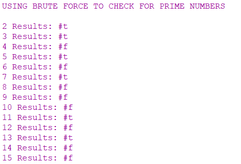

# THEORY-OF-ALGORITHMS
Answers to problems presented in the THEORY OF ALGORITHMS module.

### Problem 1:
Write, from scratch, a function in Racket that uses a brute-force algorithm that takes
a single positive integer and return true if the number is a prime and false otherwise.
Call the function decide-prime.

# Solution:
The working solution to this project can be found in the PrimeNumber.rkt file, you can open this in DrRacket and run the program.

## Whats a prime number?
A prime number is a whole number greater than 1 whose only factors are 1 and itself. A factor is a whole numbers that can be divided evenly into another number. The first few prime numbers are 2,3,5,7,11,13,17,19,23,29 and 37.

# Program Overview:

## Design
When I originally seen this question I went to investigate answers in other languages to have an idea of how to go about the problem. I found the following [post online](https://www.mkyong.com/java/how-to-determine-a-prime-number-in-java/) which showed a simple way to check for a prime number in java. I used this to get an understanding of how to do the problem and then used the racket documentation to understand how to go about doing the same thing in racket.

## Racket fundamentals:
Now after seeing it done in a language ive used before I started to read documentation on the basics of racket so I could take a more procedural approuch to checking for a prime. To create a function in racket you use the define keyword '(define id expr)'. We can allow our function to recieve a value with the following '(define (decide-prime? n)'. for/or is used to loop through the numbers smaller than the n number given and if one of these smaller numbers succefully divide with n then the loop returns and tells us that its not a prime, but if i successfully loop though all the possible numbers for n without dividing then the list will return true. At the end of each loop I use the remainder function to see if the division results in a 0.

## Testing:
I give the function some test values that I know are primes or not primes. The results show the function works, I commented out the tests but left them in the program.

## Brute Force Check:
At the bottem of the program I then do a brute force check of all the numbers from 2-101 using a normal racket for loop.

## Conclusion:
This is my first attempt at using the programming language racket, at first I found it very limited compared to other languages available but then I got used to the syntax. Overall I managed to learn some of the basics of racket, solve the problems presented and succesfully use brute force to check a set of numbers using my function.

# Program Output:

