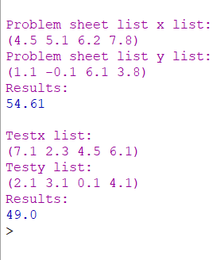

# THEORY-OF-ALGORITHMS
Answers to problems presented in the THEORY OF ALGORITHMS module.

### Problem 10:
Write a function lstq in Racket that takes as arguments two lists l and m of equal
length and containing numbers. It should return d, the distance given by the sum of
the square residuals between the numbers in the lists.

# Solution:
The working solution to this project can be found in the lstq.rkt file, you can open this in DrRacket and run the program.

# Program Overview:

## Design
I set up the problem sheet lists and then a squaring function(sqre). I created the sumList first function inside the lstq as I need that working first to lest the overall operation of lstq. sumList simply applys recursion to the operation of adding paired elements of a list with car and then taking that result and adding it to the next element until the list in empty, we can tell when the list is empty with cdr to make sure we dont throw any errors mid operation. The once the sumList was working I combined this with the sqre function at the end of the lsqt function. I take the current element of m from the current element of l , square the result and add these resulting values to a list, from here we pass the list to sumList. Repeat these steps until both lists are empty and return the summed value to the user.

## Testing
I used the 3 lists from the problem sheet to see if I got the same results as the example. The results returned '54.61' like in the example. I also set up my own test lists and got a expected result of '49.0'.

## Conclusion
Was the hardest problem of the sheet as expected since its the last question and maths is not my strongest point but the explenation under the question 'This means take the ith element of m from the ith element of l and square the result for all i. Then add all of those to get d.' helped alot in understanding the login behind the problem answer.

# Program Output:
