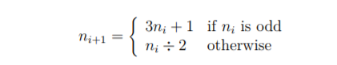

# THEORY-OF-ALGORITHMS
Answers to problems presented in the THEORY OF ALGORITHMS module.

### Problem 2:
Write, from scratch, a function in Racket that takes a positive integer n0 as input
and returns a list by recursively applying the following operation, starting with the
input number.

End the recursion when (or if) the number becomes 1. Call the function collatz-list.
So, collatz-list should return a list whose first element is n0, the second element
is n1, and so on. 

# Solution:
The working solution to this project can be found in the Rec.rkt file, you can open this in DrRacket and run the program.

## What does the equation mean?
The equation simply means if n is odd multiply it by 3 and the add 1 to the result. If n is even then divide it by 2.

# Program Overview:

## Design
After studying the equation I looked online to find the most efficient way of solveing this problem using the tools and logic racket offers. I found out about the odd? function in racket which made identifying what number should each calculation be applied to much easier. Using this function I set up a `cond` statment which works similar to `if,if else and else` statments. From here I checked if the number was one and if not we check if the number is odd or even and them apply the appropriate calculation and contine by using collatz-list as an inner function to create a recursive state that wont end until our original condition n=1 is reached. At the end of the program we pass the numbers given as examples in the problem sheet to the function to see how the results compare.

## Testing
I ran the function afew times within DrRacket and got the same results as shown in the problem sheet. The only differece is my list produces a "." and a "1" at the end of the list after the answer, although this is insignificant Im currently looking for a way to remove this from the program that does not disrupt the logic or output.

## Bug solution
At first I tried some fucntions for removing the last element in the list I found on stack overflow, none of these worked with the function I created so I tried using the library `(require srfi/1)` as it has a drop-right function I could use. After applying this I found out that the `1.1` was actually one whole element and not 3, meaning the next best thing to would be turn the last value from a decimal to a whole number. Im currently looking into way to do this with the list.

## Conclusion
I found this problem confusing at first as math is not my strongest point so it took me afew minutes to find out what the equation was asking for, but once I actually started implmenting this in code I found that this was an easier problem then problem one and it also led me to learn about the extremly handy mathmatical functions racket offers like odd? eve? and more.

# Program Output:

c#Refrences