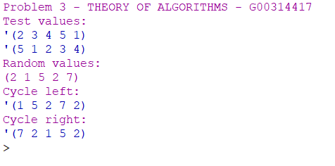

# THEORY-OF-ALGORITHMS
Answers to problems presented in the THEORY OF ALGORITHMS module.

### Problem 3:
Write, from scratch, two functions in Racket. The first is called lcycle. It takes a
list as input and returns the list cyclically shifted one place to the left. The second
is called rcycle, and it shifts the list cyclically shifted one place to the right.

# Solution:
The working solution to this project can be found in the cycles.rkt file, you can open this in DrRacket and run the program.

# Program Overview:

## Design
Cycleing the list to the left was simple enough witht the cdr and car functions to seperate the start of the list from the rest and then using append to glue the two seperate lists back together at oposite sides. I then took a similar approuch to cycling to the right but this time using the following function on [StackOverflow](https://stackoverflow.com/questions/5006750/removing-last-element-of-a-listscheme) to remove the last element after adding it to the start with append.

## Testing
I used the values our lecturer gave us in the problem sheet and the values moved it the correct direction for each method. After this I used a function from [StackOverflow](https://stackoverflow.com/questions/40497748/building-a-random-list) to create a random list to make sure the cycles would work on any list, all the random input gave the correct list cycles.

## Conclusion
I found this problem fine as there was plenty of information online and any errors I had while devloping the program ended up being simple to resolve.

# Program Output:

