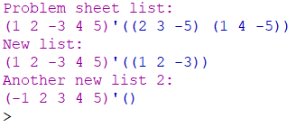

# THEORY-OF-ALGORITHMS
Answers to problems presented in the THEORY OF ALGORITHMS module.

### Problem 2:
Write a function sublsum in Racket that takes a list (of integers) as input and returns a list of sublists of it that sum to zero. For this problem, you can use the
combinations built-in function. Note the order of the sublists and their elements doesn’t matter.

# Solution:
The working solution to this project can be found in the sublsum.rkt file, you can open this in DrRacket and run the program.

# Program Overview:

## Design
I seen that the probelm sheet mentioned combonations so I went to google to read more about them, found a section under pairs in the racket documents that explained how the fucntion worked. It summed all the possible pairs in a list, I then seen the filer method and thought this could be used to find the sets that would result in only 0 when combined with the sublsum method I made. I wrote a simple function for adding the values in a list and combined it witht he build in functions above. I used rackets built in cdr function do go straight to the list results as we would get a null list first everytime as that too is a subset that results in 0.

## Testing
I used the values from the problem sheet to see if I got the same results as the example, then gave the fucntion 2 different lists, one with a single set inside that would result in 0 and another with none. The results where as expected.

## Conclusion
I thought this was one of the harder problems the fact that it included the hint to use combinations made it a but easier but it took me a while to find a refrence online on what the combination function is ain the racket documents online.

# Program Output:
