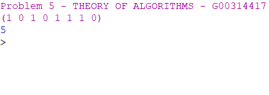

# THEORY-OF-ALGORITHMS
Answers to problems presented in the THEORY OF ALGORITHMS module.

### Problem 5:
Write a function hamming-weight in Racket that takes a list l as input and returns
the number of non-zero elements in it.

# Solution:
The working solution to this project can be found in the hammingCount.rkt file, you can open this in DrRacket and run the program.

# Program Overview:

## Design
I researched online and found a program that counted the times an element was found in the list which I've linked to in the refrences. From here I extended on the program by changing it to return the total times a element appears in the list the is not 0. I added the appropriate error checking for a null list to the function to finish it off.

## Testing
I used the values from the problem sheet to see if I got the same results as the example. The results returned 5 like in the example, I also ran afew random list through the function and the results where as expected.

## Conclusion
This problem gave me a better understanding of calculating the hamming distance of binary lists which will help me when studying for the exam in this module later in the semester.

# Program Output:
