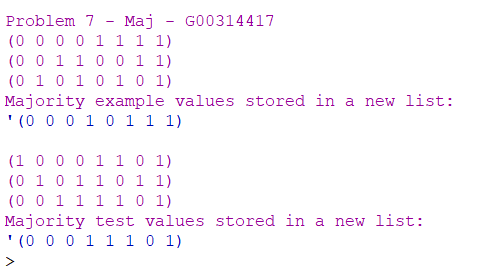

# THEORY-OF-ALGORITHMS
Answers to problems presented in the THEORY OF ALGORITHMS module.

### Problem 7:
Write a function chse in Racket that takes three lists x, y and z of equal length and
containing only 0’s and 1’s. It should return a list containing the elements of y in
the positions where x is 1 and the elements of z otherwise.

# Solution:
The working solution to this project can be found in the maj.rkt file, you can open this in DrRacket and run the program.

# Program Overview:

## Design
In this problem I decided to try seperate the computing of the lists and the error handling, maj checks for null values and compares the length of each list to see if the match in length. The maj-check funtion is seperated into 2 parts. The function defined inside called check-for-zero sums the elments and checks if the result is 0, if so return a 0. Any other result will return a 1. Then the maj-check funtion uses this operation in a recursive manner on each of the lists corrisponding element location and adds the results to a new list, once the recursion is complete we return the results to the user.

## Testing
I used the 3 lists from the problem sheet to see if I got the same results as the example. The results returned '(0 0 0 1 0 1 1 1)' like in the example. I also set up my own test lists and got a expected result of '(0 0 0 1 1 1 0 1)'.

## Conclusion
This approach of separating the error handling made the code more readable and easier to document. I seen the map function after trying this summing approach and acknowledge that this code could be refactored down to produce less code per line and maybe speed up the process of identifying the majority 1's or 0's.

# Program Output:
