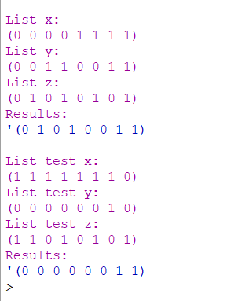

# THEORY-OF-ALGORITHMS
Answers to problems presented in the THEORY OF ALGORITHMS module.

### Problem 8:
Write a function chse in Racket that takes three lists x, y and z of equal length and
containing only 0’s and 1’s. It should return a list containing the elements of y in
the positions where x is 1 and the elements of z otherwise. 

# Solution:
The working solution to this project can be found in the chse.rkt file, you can open this in DrRacket and run the program.

# Program Overview:

## Design
First I set up the x,y and z list from the problem sheet, create the sod2 function header and constructor parameters. After I do the apporpriate error checking for null values to avoid errors along with checking for equal length as the question requires. I then use the map function to deal with each indevidual element passed from the lists one at a time in the order of location. The we check x for a 1 and if so we add the current elment from y to our new list, otherwise use the element from z. Repeat until we reach the end of all the lists and a new list is returned.

## Testing
I used the 3 lists from the problem sheet to see if I got the same results as the example. The results returned (0 1 0 1 0 0 1 1)' like in the example. I also set up my own test lists and got a expected result of (0 0 0 0 0 0 1 1).

## Conclusion
Map function made the problem of dealing with list element locations much easier.

# Program Output:
