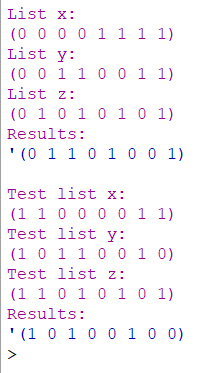

# THEORY-OF-ALGORITHMS
Answers to problems presented in the THEORY OF ALGORITHMS module.

### Problem 9:
Write a function hamming-distance in Racket that takes two lists and returns the
number of positions in which they differ.

Write a function sod2 in Racket that takes three lists x, y and z of equal length and
containing only 0’s and 1’s. It should return a list containing a 1 where the number of
1’s in a given position in x, y and z contains an odd nubmer of 1’s, and 0 otherwise.

# Solution:
The working solution to this project can be found in the sod.rkt file, you can open this in DrRacket and run the program.

# Program Overview:

## Design
First I set up the x,y and z list from the problem sheet, create the sod2 function header and constructor parameters. After I do the apporpriate error checking for null values to avoid errors along with checking for equal length as the question requires. I then use the map function to deal with each indevidual element passed from the lists one at a time in the order of location. From here its simply checking if the current 3 elements being dealt with during the recursion are a odd number of 1's, if they are place a 1 in the corresponding position of our new list, otherwise place a 0! when the recrsion ends return the newly formed list.

## Testing
I used the 3 lists from the problem sheet to see if I got the same results as the example. The results returned '(0 1 1 0 1 0 0 1)' like in the example. I also set up my own test lists and got a expected result of (1 0 1 0 0 1 0 0).

## Conclusion
This problem helped me get a better understanding of the map function in racket and how to use it, because of rackets functional style of compiling getting better at using this function as a result of the recent problems has made racket much easier for me to use.

# Program Output:
