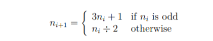

# THEORY-OF-ALGORITHMS
Answers to problems presented in the THEORY OF ALGORITHMS module.

## Racket programming language
Racket (formerly PLT Scheme) is a general purpose, multi-paradigm programming language in the Lisp-Scheme family. One of its design goals is to serve as a platform for language creation, design, and implementation. The language is used in a variety of contexts such as scripting, general-purpose programming, computer science education, and research.The syntax is uniform and made of s-expressions. An s-expression is an atom or a sequence of atoms separated by spaces and enclosed in parenthesis. Square brackets [] and braces {} can be used instead of parenthesis (as long as they match per type).

## Programming enviroment - DrRacket:
The platform provides an implementation of the Racket language (including a sophisticated run-time system, various libraries, JIT compiler, and more) along with a development environment called DrRacket (formerly named DrScheme) written in Racket itself. The IDE and an accompanying programming curriculum is used in the ProgramByDesign outreach program, an attempt to turn computing and programming into "an indispensable part of the liberal arts curriculum". The core language is known for its extensive macro system which enables the creation of embedded and domain-specific languages, language constructs such as classes or modules, and separate dialects of Racket with different semantics.

The platform distribution is free and open-source software distributed under the GNU Lesser General Public License (LGPL) license. Extensions and packages written by the community are uploaded to Racket's centralized package catalog.

## Getting started

- Install git 'https://git-scm.com/downloads'
- Download racket: 'https://download.racket-lang.org/'

To download the soultions to these problems navigate to a folder in the cmd, type git clone and paste in the following url:
'https://github.com/ConorTighe1995/THEORY-OF-ALGORITHMS.git'

# Module Problems:
Here are all the problems ive been assigned by my lecturer Ian, I have sorted the racket program files and documentation into folders to make each problem answer easier to read and navigate. The folders for each answer to the probelems presented can be seen above in the repo.

---

### Problem 1:
Write, from scratch, a function in Racket that uses a brute-force algorithm that takes
a single positive integer and return true if the number is a prime and false otherwise.
Call the function decide-prime.

---

### Problem 2:
Write, from scratch, a function in Racket that takes a positive integer n0 as input
and returns a list by recursively applying the following operation, starting with the
input number.

End the recursion when (or if) the number becomes 1. Call the function collatz-list.
So, collatz-list should return a list whose first element is n0, the second element
is n1, and so on.

---

### Problem 3:
Write, from scratch, two functions in Racket. The first is called lcycle. It takes a
list as input and returns the list cyclically shifted one place to the left. The second
is called rcycle, and it shifts the list cyclically shifted one place to the right.

---

## References for all the problems:

-[DrRacket](https://racket-lang.org/)

-[Racket docs](https://docs.racket-lang.org/)

-[Racket (programming language)](https://en.wikipedia.org/wiki/Racket_(programming_language))
