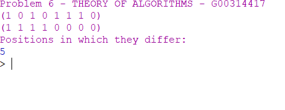

# THEORY-OF-ALGORITHMS
Answers to problems presented in the THEORY OF ALGORITHMS module.

### Problem 6:
Write a function hamming-distance in Racket that takes two lists and returns the
number of positions in which they differ.

## What is hamming distance?
In information theory, the Hamming distance between two strings of equal length is the number of positions at which the corresponding symbols are different. In other words, it measures the minimum number of substitutions required to change one string into the other, or the minimum number of errors that could have transformed one string into the other. In a more general context, the Hamming distance is one of several string metrics for measuring the edit distance between two sequences.

# Solution:
The working solution to this project can be found in the hammingCompare.rkt file, you can open this in DrRacket and run the program.

# Program Overview:

## Design
First thing I did was add error handling to the function I'd use to compare the lists to check if both are not null. Then I used the racket docs to reseach recursion over 2 lists to see how to properly compare each element and see if they are equal. After doing the comparing depending on the results the function will continue or add one to the the count and continue. This process will repeat until we reach the end of the list.

## Testing
I used both lists from the problem sheet to see if I got the same results as the example. The results returned 5 like in the example, I also pairs of random lists to double check the function and the results where as expected.

## Conclusion
This problem was much harder then the last hamming related question but just like the last one I feel like I have a much better understanding of the hamming distance method after attempting this problem.

# Program Output:
